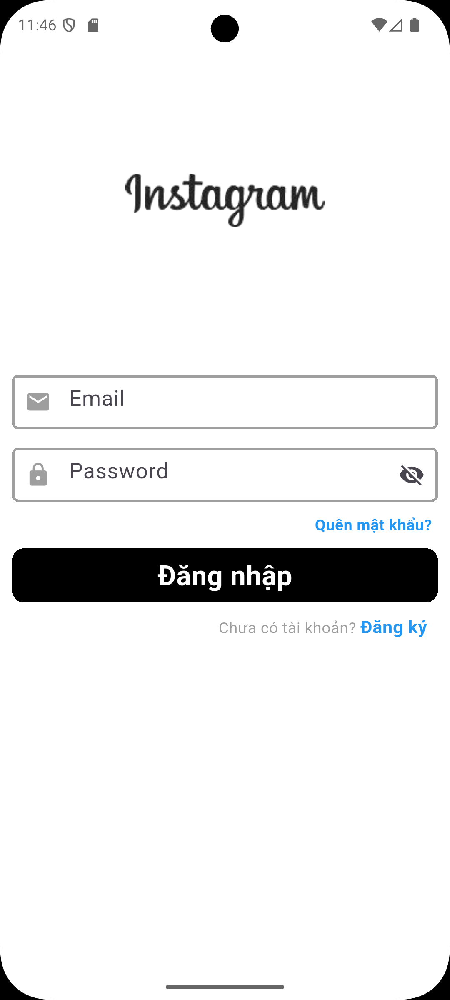
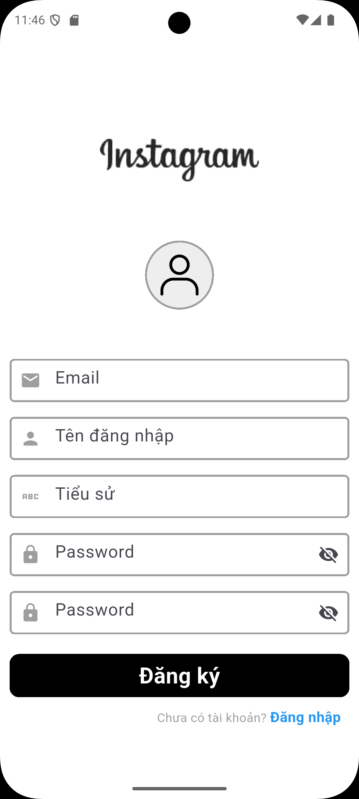
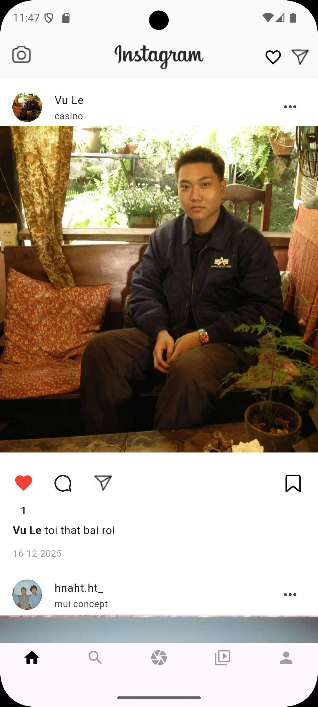
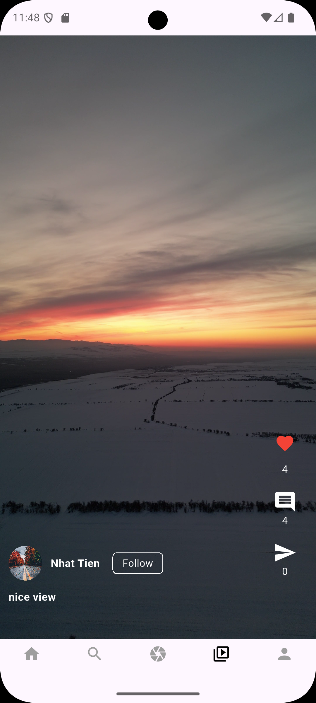
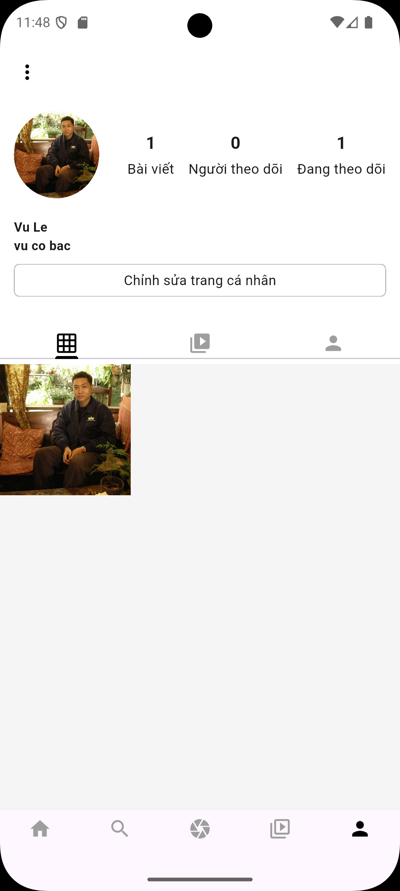

# 📸 My-Instagram (Flutter)

**My-Instagram** is a Flutter-based Instagram clone built for **learning and practice purposes**.  
This project demonstrates how to build a simple social media application using **Flutter** and **Firebase**.

---

## 🚀 Features

- 🔐 User authentication (Sign up / Sign in)
- 🧑‍💼 User profile management
- 🖼️ Create posts with images
- 📰 Realtime post feed
- ❤️ Like posts
- 💬 Comment on posts
- 🚪 Logout

---

## 🛠️ Technologies Used

- **Flutter**
- **Dart**
- **Firebase Authentication**
- **Firebase Cloud Firestore**
- **Firebase Cloud Storage**
- **Material Design**

---

## 📂 Project Structure

```text
lib/
├── auth/                 # Authentication logic (login, register)
├── data/                 # Models & data handling
├── screen/               # UI screens (login, feed, profile, post...)
├── util/                 # Helper & utility functions
├── widgets/              # Reusable widgets
├── firebase_options.dart # Firebase configuration
└── main.dart             # Application entry point

assets/                   # Demo images
```
## 🔥 Firebase Services

| Service                 | Description                         |
| ----------------------- | ----------------------------------- |
| Firebase Authentication | User login & registration           |
| Cloud Firestore         | Store users, posts, likes, comments |
| Firebase Storage        | Store uploaded images               |

## 🔐 Login & Signup Screen


## 📰 Feed Screen


## 🔍 Explore Screen

## 🎞️ Reels Screen

## ➕ Add Post Screen

## 👤 Profile Screen



